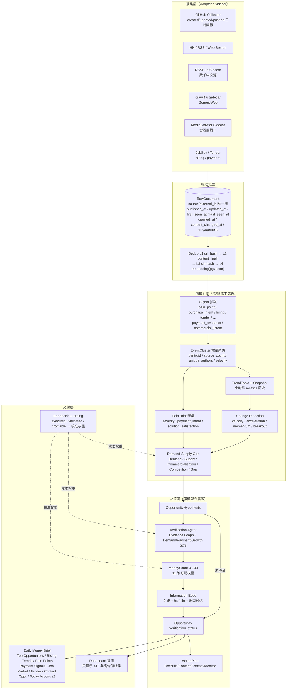

# MONEY_INTELLIGENCE_ROADMAP — 从机会发现 SaaS 到 Personal Money Intelligence OS

> 依据：[CURRENT_ARCHITECTURE.md](./CURRENT_ARCHITECTURE.md)（Phase 0 审计）+ [docs/research/open-source-benchmark.md](./docs/research/open-source-benchmark.md)。
> 产品目标：不是"爬更多数据"，而是每天回答一个问题——**"今天有什么变化值得赚钱？"**
> 原则：抓取不是产品。发现别人还没注意到、但已出现真实需求和付费证据的变化，才是产品。

---

## 0. 目标架构



**LLM 成本漏斗（每 run 计量入 radar_runs.stage_stats + llm_calls.stage/cost）**：

```
Stage 0 规则过滤      10000 → 3000     （关键词/黑名单/长度，零成本）
Stage 1 Embedding 相关  3000 → 500      （embedding 余弦，近乎零成本）
Stage 2 语义聚类         500 → 100 簇   （pgvector，零 LLM）
Stage 3 Signal/Gap 检测  100 → 30       （规则 + cheap model）
Stage 4 强模型深研        30 → 10 机会
Stage 5 Action Plan      10 → Top 5 / ≤3 actions
```

---

## 1. Phase 0 — Audit ✅（已完成）

产出 `CURRENT_ARCHITECTURE.md`。关键确认：GitHub created_at 新鲜度误杀（P0-1）、web_search published_at=None（P0-2）、默认内存存储、无 pgvector、无聚类、LLM 无漏斗、brief 硬编码。

## 2. Phase 1 — Data Foundation（本次实施，详见 §10 文件清单）

**目标**：让"变化"可度量、让"同一事件"可聚合、让评分从"接单评分"升级为"赚钱评分"。不写任何新平台爬虫。

| 维度 | 内容 |
|---|---|
| 代码改动 | 时间戳规范落地（collectors + run service）；simhash + embedding 语义去重（L1–L4）；Signal 规则抽取；EventCluster 增量聚类；TrendTopic + Snapshot；Change Detection（velocity/acceleration/momentum/breakout）；MoneyScore（11 维可配）；InformationEdge（9 维）；Source Health；Brief V2 数据层；`/api/intelligence` 只读路由；scheduler 增加小时级快照任务 |
| Schema 改动 | `202610060001_money_intelligence.sql`：raw_items 扩列（first_seen_at/last_seen_at/seen_count/simhash/embedding vector(1536)/engagement/language/platform/content_changed_at/crawled_at/updated_at_source）；新表 signals / event_clusters / event_cluster_members / trend_topics / trend_snapshots / change_events / source_health；opportunities + money_score/money_breakdown/information_edge/information_edge_breakdown/verification_status；daily_briefs + V2 jsonb 列；llm_calls + stage/tokens/cost；radar_runs + stage_stats |
| API 改动 | 纯增量：`GET /api/intelligence/{signals,clusters,trends,changes,source-health}`；brief 旧字段原样保留 + 新增 v2 字段。**不破坏任何现有契约** |
| 测试 | 12 个新测试文件（simhash/四级去重/聚类/趋势/breakout/money/edge/health/契约/时间修复/brief V2/mark_raw upsert） |
| 风险 | pgvector 依赖（Supabase 原生支持；docker 用 pgvector/pgvector 镜像）；embedding 无 key 时优雅降级为纯 hash+simhash |
| 验收 | pytest 全绿（含 CI 中跑通 PG 契约测试）；老仓库新爆发不再被过滤；同内容不同 URL 不再重复生成机会；每个 run 记录 stage 漏斗计数 |

## 3. Phase 2 — Signal + Cluster（深化）

- Signal 抽取从规则升级为 **cheap model + schema 约束**（llm_fast_model 分级接入），规则词典继续兜底。
- EventCluster 增加 merge/split 维护（merged_into 链已预留）、representative documents 选择策略（最高 engagement × 最新）。
- PainPoint Engine 独立模块：pain 聚类 + mention_count/growth/severity/payment_intent/current_solutions/solution_satisfaction。
- 自然语言 Listener（openmagpie 模式）：Radar 允许 `listener_description` 文本，编译为 positive/negative 关键词 + 语义阈值，作用于 cluster 而非单条。
- Schema：signals 增加集群级聚合表 pain_points；radars 增加 listener 配置列。
- 验收：同一事件 5 平台 88 条原始数据聚成 1 个 cluster；pain point 报表可回答"最近用户集中抱怨什么"。

## 4. Phase 3 — Trend + Change（深化）

- Snapshot 从小时级扩展到 1h/24h/7d/30d 滚动窗口 API；trend_topics 增加 cross-radar 全局聚合（当前 per-radar）。
- breakout 算法校准（z-score 阈值 + 最小样本数 + 饱和抑制）；新词爆发（历史为 0 但今日激增）单独通道。
- GitHub stars/forks/issues、job count、tender count 纳入 MetricHistory（collector 定期回访已知 key 对象）。
- 验收：构造 7 日基线 18 条/今日 97 条 fixture → is_breakout=true 有测试锁定。

## 5. Phase 4 — Gap + MoneyScore（深化）

- Demand-Supply Gap Engine：Demand（signal 强度×velocity）/ Supply（竞品数+开源替代+满意度反向）/ Commercialization（payment evidence+tender+budget）/ Competition 四个独立子分 + Gap Score。
- GitHub Issues 商业化信号抽取（hosted/cloud/API/mobile/paid/alternative/self-hosted too hard 关键词族）。
- MoneyScore 权重暴露为配置 + 用户级覆盖；反馈学习开始写入 calibration 表。
- 验收：给定需求强/供给弱/竞争弱样例 → Gap>85、Money>85；需求强但供给饱和样例 → Gap<50。

## 6. Phase 5 — Verification Agent

- OpportunityHypothesis 与 Opportunity 分离（表已预留 verification_status）。
- 高价值假设主动取证：多平台需求证据 / 价格 / 招聘 / 外包 / 竞品 / 抱怨 / GitHub / 趋势 → Evidence Graph（jsonb）。
- 硬门槛：Demand/Payment/Growth 三类证据 ≥2 才可 verified；否则 unverified 展示（明确标注，不是隐藏）。
- 输出 confidence + 反驳条件（"什么情况说明这个判断错了"）。
- 禁用词表：必赚/财富密码/稳赚 → 生成时拦截。
- 验收：每个 verified 机会可回答用户 13 问（roadmap §13 清单）。

## 7. Phase 6 — Source Expansion（Adapter 体系）

- `CollectorCapabilities` 已在 Phase 1 落地（search/timeline/comments/profile/detail/historical/realtime/change_detection + healthcheck）。
- 优先顺序：RSSHubAdapter（一次接入数千中文源）→ Crawl4AIAdapter（GenericWeb）→ GitHubIssueCollector / GitHubReleaseCollector → JobMarketCollector（JobSpy pip 嵌入）→ RedditCollector（官方 API）→ V2EX / ProductHunt / HuggingFace（公开 API）→ TenderCollector → MediaCrawler sidecar（合规前提 + 明确授权）。
- SourcePack：social/developer/demand/money/intelligence 五个包，Radar 创建时选目标自动映射源集合。
- 每个 adapter 必须实现 healthcheck + capabilities，注册进 source_health 监控。
- 验收：单 collector 全挂 → run 仍完成，health 面板显示 unhealthy；模拟 429 → 退避生效且计入统计。

## 8. Phase 7 — Daily Intelligence

- Daily Money Brief 生成器（Phase 1 已落数据层 + 组装器骨架）：Top Opportunities（含正反两面论证）/ Rising Trends / Pain Points / Payment Signals / Job Market / Tender / Content Opportunities / Today Actions ≤3。
- LLM 生成 summary 与"为什么值得/不值得做"（强模型，每日每用户 1 次，成本可控）。
- `GET /api/daily-brief/{date}` 读真实历史（Phase 1 已修组装层，历史列已落库）。
- Dashboard 首页改版：Top Money Opportunities / Trend Breakouts / Demand Signals / Pain Points / Money Signals / Latest Changes / Today Actions；移除"扫描了多少条"类虚荣指标到次级页。
- ActionPlan 模型：Do Service / Build Product / Create Content / Contact Lead / Monitor / Ignore，含验证 MVP、成本、定价、第一单路径、失败条件。
- 验收：brief 每个 section 有数据来源且非硬编码；actions ≤3 有测试锁定。

## 9. Phase 8 — Feedback Learning

- 事件扩展：executed / validated / invalidated / profitable / unprofitable（schema 预留 check 扩展迁移）。
- 学习目标从"用户喜欢什么"升级为"什么机会真的赚钱"：MoneyScore 权重按 profitable/unprofitable 结果做在线校准（受限幅）。
- 验收：模拟 100 次高 MoneyScore 但 unprofitable 的反馈 → payment_evidence 权重自动上调且有界。

---

## 10. 目标数据模型（ pipeline 全景）

```
RawDocument（= raw_items 扩列，不建新表——向后兼容）
  └─ Signal（signals，n:1 → raw_item）
       └─ EventCluster（event_clusters ← event_cluster_members n:n signals/raw_items）
            ├─ TrendTopic / TrendSnapshot（trend_topics / trend_snapshots，小时级）
            ├─ ChangeEvent（change_events，breakout 检测产物）
            └─ PainPoint（Phase 2）
                 └─ OpportunityHypothesis（= opportunities + verification_status，Phase 5 拆表）
                      └─ Verification（evidence_graph jsonb，Phase 5）
                      └─ MoneyScore / InformationEdge（money_breakdown / information_edge_breakdown jsonb，Phase 1 已落）
                           └─ ActionPlan（Phase 7，jsonb 起步）
```

关键表 Phase 1 已全部建出（空转不亏，Phase 2+ 直接填肉）；`merged_into`、`verification_status`、`evidence_graph` 等升级位已预留。

## 11. Phase 1 具体文件修改清单

**新增（backend/app/）**
| 文件 | 职责 |
|---|---|
| `schemas/intelligence.py` | SignalType、SignalRead、EventClusterRead、TrendSnapshotRead、ChangeEventRead、SourceHealthRead、MoneyScoreBreakdown、InformationEdgeBreakdown、StageStats、DailyBriefV2 |
| `services/simhash.py` | 纯 Python simhash64 + 汉明距离 |
| `services/embedding_service.py` | OpenAI 兼容 /embeddings + 批处理 + 失败返回 None（降级） |
| `services/semantic_dedup.py` | 四级去重编排：url/content/simhash/cosine |
| `services/signal_service.py` | 规则词典抽取 Signal（15 类）；LLM 钩子预留 |
| `services/clustering_service.py` | 增量聚类：centroid 余弦归并 + Jaccard 兜底 |
| `services/trend_service.py` | trend topic upsert + 小时级 snapshot |
| `services/change_detection.py` | 7d 基线 z-score → velocity/acceleration/momentum/breakout |
| `services/money_score.py` | 11 维加权，权重可配置 |
| `services/information_edge.py` | 9 维 + half-life |
| `services/source_health_service.py` | 记录每次 collector 调用 → health score |
| `services/daily_intelligence.py` | Brief V2 组装（真数据，无 LLM 也成立） |
| `api/intelligence.py` | 只读路由 signals/clusters/trends/changes/source-health |

**修改（backend/app/）**
| 文件 | 改动 |
|---|---|
| `collectors/base.py` | +CollectorCapabilities dataclass + `capabilities()` + `healthcheck()` |
| `collectors/github.py` | 时间修复：metadata 存 created/updated/pushed 三者；published_at=created_at；新增 `updated_at_source`（pushed_at）传递 |
| `collectors/web_search.py` | 日期提取（递归找 published/date 字段）+ date range 参数 |
| `collectors/hackernews.py, rss.py, mock.py` | 填 updated_at_source / engagement |
| `collectors/registry.py` | search() 包 source_health 记录 |
| `services/dedup_service.py` | +simhash 层；semantic 接口实装 |
| `services/radar_run_service.py` | 新鲜度改 activity time；Stage 漏斗 + stage_stats；signal/cluster/trend/change 集成；opportunity 挂 MoneyScore/Edge |
| `repositories/base.py` | Protocol 增补 8 个方法 |
| `repositories/memory.py` | 同步实现（signals/clusters/trends/changes/health + mark_raw upsert 语义 + seen_count） |
| `repositories/postgres.py` | 同步实现（pgvector 查询 + ON CONFLICT DO UPDATE） |
| `schemas/domain.py` | RawItem +updated_at_source/engagement/language/platform（向后兼容默认值）；OpportunityRead +money_score 等；DailyBriefRead +v2 字段；RadarRunRead +stage_stats |
| `ai/provider.py` | embed() 真实现 |
| `core/config.py` | +embedding_model/money_score_weights_json/breakout 配置 |
| `api/briefs.py` | 返回 V2 字段 |
| `api/dashboard.py` | 保持契约，增补 intelligence 摘要（可选字段） |
| `workers/scheduler.py` | +每小时 trend snapshot / cluster 维护 tick |
| `workers/settings.py` | +注册 snapshot job |
| `main.py` | +intelligence router |
| `supabase/migrations/202610060001_money_intelligence.sql` | 全部 DDL |
| `docker-compose.yml` | +postgres(pgvector) 服务 + init 脚本 + 迁移执行 |
| `.github/workflows/ci.yml` | +pgvector service，PG 契约测试不再 skip |
| `backend/tests/test_*.py` | 12 个新测试文件 |

**不改**：前端所有文件（Phase 1 契约零破坏）；现有 7 个测试文件必须原样通过。

## 12. 用户 13 问 → 系统字段映射（Phase 5 验收基准）

| # | 问题 | 数据来源 |
|---|---|---|
| 1 | 谁需要？ | Signal.entities + cluster unique_authors/platforms |
| 2 | 为什么现在需要？ | ChangeEvent（velocity/breakout）+ signal.urgency |
| 3 | 有多少需求证据？ | cluster.document_count / source_count / signal 计数 |
| 4 | 有没有付钱证据？ | signals(payment_evidence) + money_breakdown.payment_evidence |
| 5 | 需求是不是在增长？ | trend velocity/acceleration + engagement_growth |
| 6 | 市场有没有成熟解决方案？ | money_breakdown.supply_gap（Phase 4 深化） |
| 7 | 竞争激不激烈？ | money_breakdown.competition |
| 8 | 为什么存在信息差？ | information_edge_breakdown.novelty/source_rarity |
| 9 | 信息差窗口还有多久？ | information_edge.half_life + window estimate |
| 10 | 我是否有能力执行？ | profile skills vs opportunity skills（已有 skill_match） |
| 11 | 最低成本如何验证？ | ActionPlan.verification_mvp（Phase 7） |
| 12 | 第一笔钱从哪里来？ | ActionPlan.first_revenue_path（Phase 7） |
| 13 | 什么情况说明判断错了？ | verification.invalidation_conditions（Phase 5） |

Phase 1 交付 1–5、7–9 的数据基础；6 部分供给信号；10–13 按 Phase 5/7 兑现。**答不齐 13 问的机会，永远不得标 verified。**

---

## 附录 A — 改进积压清单（2026-10-06 研究评审产出）

**状态更新（2026-10-06 第二轮）**：P1 护栏 8 项已全部落地（per-user token 预算 / 保留 TTL / scheduler 锁+jitter / compose 排除 Mock / payment 按 cluster 聚合 / structlog / brief 历史真读 / RLS 文档化）；Phase 2 四模块已落地（自然语言 Listener / 快模型 Signal 抽取 / PainPoint Engine / Cluster merge）。以下清单剩余项：

### 剩余 P2 — 质量与产品面
| 项 | 说明 | 成本 |
|---|---|---|
| Golden dataset + CI 评测 | 30–50 条标注 fixture（每 signal 类型），确定性 grader（类型精确匹配/payment 布尔/budget 误差），CI 回归——级联与校准的前提 | S/M |
| EWMA + CUSUM breakout | 替代/增强裸 z-score；稀疏 0-100/日计数下更稳，CUSUM 专抓持续性上移 | S |
| pgvector halfvec(1536) | vector(1536) ~6KB/行会 TOAST；halfvec 减半存储 + HNSW 已建 | S/M |
| 级联路由 | cheap model 先行 + 校准置信门升级强模型（RouteLLM 实测 >2x 降本）；快模型已用于 signal/listener，级联门待做 | M |
| 语义缓存 | pgvector `semantic_cache` 表，同义输入命中（阈值要高，防"自信地错"） | M |
| 前端 Dashboard V2 | 消费 /api/intelligence + brief V2 字段（当前前端对新 API 零消费） | M |
| 分数校准 | Platt/isotonic 把 MoneyScore 映射到真实盈利率（依赖 Phase 8 反馈数据） | L |
| Cluster split / 漂移分裂 | merge 已做；临时 vs 持续漂移判别 → 分裂/退役（centroid 已持续记录） | M/L |

### 以下为已完成记录（原清单存档）
~~P1：per-user token 预算 / 数据保留 TTL / scheduler 锁 / Mock 排除 / payment 聚合 / structlog / brief 历史 / RLS 文档~~ ✅ 2026-10-06
~~Phase 2：Signal LLM 抽取 / PainPoint Engine / 自然语言 Listener / Cluster merge~~ ✅ 2026-10-06
