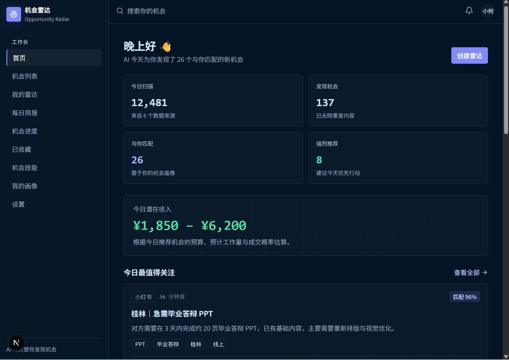

# 机会雷达 · Opportunity Radar

面向中文用户的 AI 机会发现 Web SaaS 前端原型。它围绕「发现机会 → 判断机会 → 管理机会 → 采取行动」设计，使用本地 Mock 数据模拟完整产品流程。



## 功能

- 中文 Landing、Onboarding、Dashboard、机会列表与分析详情
- 雷达创建、运行/暂停、搜索策略预览
- 机会收藏、联系、忽略与 Pipeline 看板/列表联动
- 每日简报、技能模块、用户画像与设置页
- Zustand 本地持久化状态与可替换的 Mock API/service 层

## 技术栈

Next.js App Router、TypeScript、Tailwind CSS、Zustand、Lucide Icons。

## 本地运行

```bash
npm install
npm run dev
```

打开 `http://localhost:3000`。如端口被占用，请使用 `npm run dev -- --port 3001`。

## 校验

```bash
npm run lint
npm run test
npm run build
```
